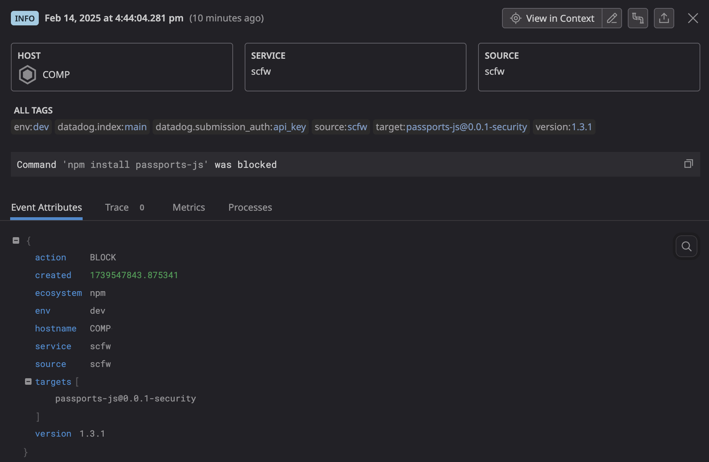

# Supply-chain firewall


The supply-chain firewall is a command-line tool for preventing the installation of malicious PyPI and npm packages.  It is intended primarily for use by engineers to protect their development workstations from compromise in a supply-chain attack.


The firewall collects all targets that would be installed by a given `pip` or `npm` command and checks them against reputable sources of data on open source malware and vulnerabilities.  The command is automatically blocked when any data source finds that any target is malicious.  In cases where a data source reports other findings for a target, the findings are presented to the user along with a prompt confirming intent to proceed with the installation.

Default data sources include:

- Datadog Security Research's public malicious packages [dataset](https://github.com/DataDog/malicious-software-packages-dataset)
- [OSV.dev](https://osv.dev) disclosures

Users may also implement verifiers for alternative data sources. Consult the API documentation for details.

The principal goal of the supply-chain firewall is to block 100% of installations of known-malicious packages within the purview of its data sources.

## Getting started

### Installation

Clone the repository and run `make install`.  This will install the `scfw` command-line program into your global Python environment.  If desired, this can be done inside a `virtualenv`.

```bash
git clone https://github.com/DataDog/supply-chain-firewall.git
cd supply-chain-firewall
make install
```

To check whether the installation succeeded, run the following command and verify that you see the help message output below.
```bash
$ scfw -h
usage: scfw [options] COMMAND

A tool to prevent the installation of vulnerable or malicious pip and npm packages

options:
  -h, --help         show this help message and exit
  --dry-run          Verify any installation targets but do not run the package manager command
  --log-level LEVEL  Desired logging level (default: WARNING, options: DEBUG, INFO, WARNING, ERROR)
  --executable PATH  Python or npm executable to use for running commands (default: environmentally determined)
  --verifiers PATH   Directory from which installation target verifiers should be sourced (default: scfw/verifiers)
  --loggers PATH     Directory from which loggers should be sourced (default: scfw/loggers)
```

### Compatibility

The supply-chain firewall is compatible with `pip >= 22.2` and `npm >= 7.0`.  In keeping with its goal of blocking 100% of known-malicious package installations, the firewall will refuse to run with an incompatible version of `pip` or `npm`.  Please upgrade to or verify that you are running a compatible version of `pip` or `npm` before using this tool.

## Usage

To use the supply-chain firewall, just prepend `scfw` to the `pip install` or `npm install` command you want to run.

```
$ scfw npm install react
$ scfw pip install -r requirements.txt
```

For `pip install` commands, the firewall will install packages in the same environment (virtual or global) in which the command was run.

If desired, the following aliases can be added to one's `.bashrc`/`.zshrc` file to passively run all `pip` and `npm` commands through the firewall.

```
alias pip="scfw pip"
alias npm="scfw npm"
```

## Datadog Logs integration

The supply-chain firewall can optionally send logs of blocked and successful installations to Datadog.



To opt in, set the environment variable `DD_API_KEY` to your Datadog API key, either directly in your shell environment or in a `.env` file in the current working directory.

Users may also implement custom loggers for use with the firewall.  Consult the API documentation for details.

## Development

To set up for testing and development, create a fresh `virtualenv`, activate it and run `make install-dev`.  This will install `scfw` and the development dependencies.

### Testing

The test suite may be executed in the development environment by running `make test`.  To additionally view code coverage, run `make coverage`.

To facilitate testing "in the wild", `scfw` provides a `--dry-run` option that will verify any installation targets and exit without executing the given package manager command:

```
$ scfw --dry-run npm install axios
Dry-run: no issues found, exiting without running command.
```

Of course, one can always test inside a container or VM for an added layer of protection, if desired.

### Code quality

The supply-chain firewall code may be typechecked with `mypy` and linted with `flake8`.  Run `make typecheck` or `make lint`, respectively, in the environment where the development dependencies have been installed.

Run `make checks` to run the full suite of code quality checks, including tests.  These are the same checks that run in the repository's CI, the only difference being that the CI jobs matrix test against a range of `pip` and `npm` versions.  There is also a pre-commit hook that runs the checks in case one wishes to run them on each commit.

### Documentation

API documentation may be built via `pdoc` by running `make docs` from your development environment.  This will automatically open the documentation in your system's default browser.

## Feedback

All constructive feedback is welcome and greatly appreciated.  Please feel free to open an issue in this repository or reach out to Ian Kretz (ian.kretz@datadoghq.com) directly via Slack or email.
